# Introduction { .intro }

It’s important not to use your real name or any personal information in your online username. In this project you’ll generate usernames that you can use on websites like Scratch. 

To try out the finished project:
+ Click the girl to generate a new username;
+ When you find a username you like click on the tick to add it to the list;
+ Right-click on the username list to save your list of usernames to a file. 

  <iframe allowtransparency="true" width="485" height="402" src="https://scratch.mit.edu/projects/embed/138858379/?autostart=false" frameborder="0"></iframe>
  

# Step 1: Generating Usernames { .activity .new-page }

There are lots of websites and apps that use a username to identify you. This username is often visible to others. Usernames can also be called screen names, gamer tags or handles. 

It’s important that your user name isn’t your real name and doesn’t include personal information such as your age, year of birth or where you live. Other people will see your username so make sure it’s polite and consider what people will think about you when they read it. Remember that you might be using your username for a long time, will you still like it in three years? 

As you can see, it’s important to choose your username carefully. Let's create a Scratch project to generate _AdjectiveNoun_ usernames like __DiamondIguana__. 

## Activity Checklist { .check }

+ Open the 'Username Generator' Scratch project. Your club leader will give you a copy of this project, or you can open it online at <a href="http://jumpto.cc/usernames-go" target="_blank">jumpto.cc/usernames-go</a>.

+ You should see two lists on the stage: `adjectives` and `nouns`:

	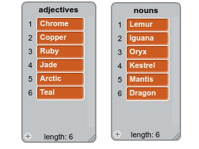

+ Click on Data and then uncheck the boxes next to `adjectives` and `nouns` to hide them.

	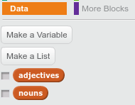
	
+ Add a variable called `username`:

	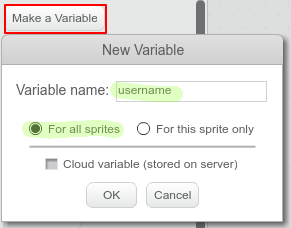
	
+ Uncheck the box next to the username variable to hide it from the stage:

	

+ Add a person sprite, you can choose which one. 

	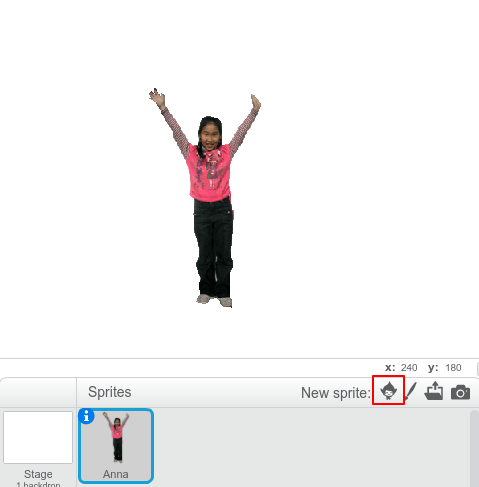
	
	You can also click on Costumes and choose the costume that you prefer.

+ Add this code to your person sprite:

	
	
+ You need to combine an adjective and a noun. Add a join block inside your set block:

	
	
+ Add a random adjective in the first box in the join:

	
	
+ Add a random noun in the second box:

	
	
+ Now add the code to get your person to say the username:

	

+ Test your code by clicking on the person. You should get a new random username each time. 

	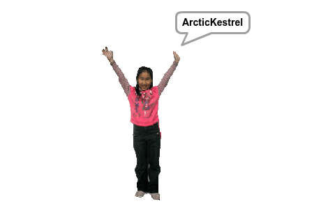

## Save your project { .save }

##Challenge: Add more variety { .challenge }
Can you add more items to the lists of adjectives and nouns?

Check the tickboxes for the lists to show them on the stage. Then click the __+__ to add a new item to the list. Don't forget to start each word with a capital letter. 

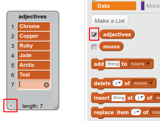

Real and imaginary animals and creatures work well for nouns. Try to think of unusual ones.

Here are some ideas for adjectives:

+ Metals: Zinc, Copper, Iron, Brass, Silver, Gold
+ Colours: Crimson, Aqua, Magenta, Golden, Indigo
+ Gems: Quartz, Emerald, Sapphire, Diamond
+ Habitats: Moon, Desert, Snow, Jungle, Forest, Space

Remember to hide the lists from the stage when testing your project. 

## Save your project { .save }

# Step 2: Saving Your Favourite Usernams { .activity }

You probably want to consider a few different usernames. Let’s add usernames that you like to a list. 

## Activity Checklist { .check }

+ Create a new list called 'names I like':

	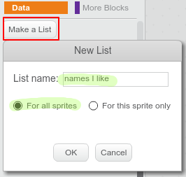

+ The list will appear on the stage. Drag it to the right of your person and make it wider:

	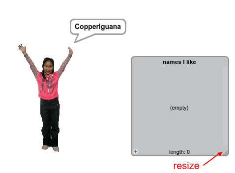

+ Add the tick sprite and drag the tick sprite on the stage to the right of the speech bubble:

	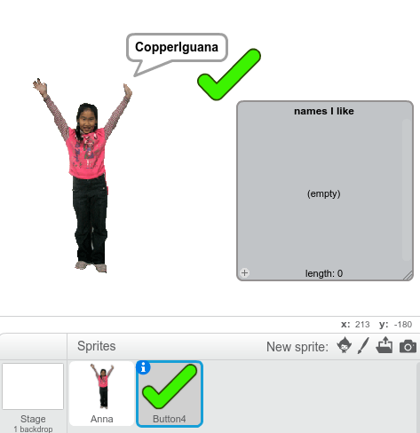

+ Add code to the tick sprite to add the current username to 'names I like' when the tick is clicked: 

	

+ Test your code by clicking on the person until you find a username you like and then clicking on the tick:

	

+ You can export your list of possible usernames to a text file. Right-click on the `names I like` list on the Stage and choose 'Export' ad choose a place to save (check with your volunteer if you're not sure where to save.) 

	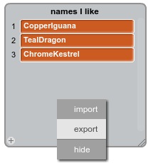
	
	You now have a text file containing a list of names which you can open with Notepad or another text editor. 

## Save your project { .save }

##Challenge: Add a number { .challenge }

On some popular websites and apps it can be really hard to find a username that someone else hasn’t already used. You might find that the username you use on other sites is already taken. You could add a number to the end of the username. Remember not to use your age or your date or year of birth. 

Can you use these blocks to generate usernames with a random number on the end. 

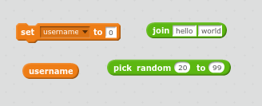

Your new usernames should have numbers on the end:

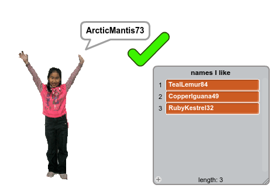

## Save your project { .save }

##Challenge: Create your profile picture { .challenge }

Can you use the costume painting tool in Scratch to create your own profile picture to go with a username? 

If you want to try drawing using shapes that you can move around then switch to vector mode:

Here's an example:

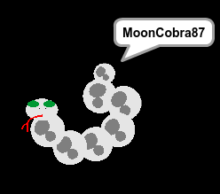

You can also save your picture so you can use it on websites or apps that use a profile picture. Right-click on a costume to save it to a local file:

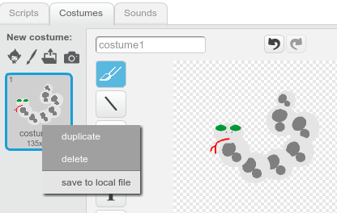

Images created in bitmap mode will be saved as '.png' files. Images created in vector mode will be saved as '.svg' files. 

'.png' files are more widely used, you can switch to bitmap mode before saving to get a '.png' file (undo will get you back to vector mode.)

## Save your project { .save }