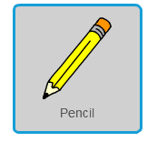
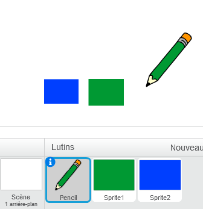
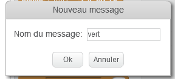
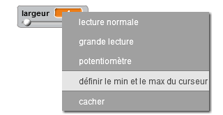
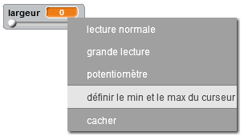

# Introduction { .intro }

Dans ce projet, vous ferez votre propre programme de peinture!

<div class="scratch-preview">
 <iframe allowtransparency="true" width="485" height="402" src="https://scratch.mit.edu/projects/embed/63473366/?autostart=false" frameborder="0"></iframe>
 
</div>

# Étape 1 : Fabrication d'un crayon { .activity }

Commençons en faisant un crayon, qui peut être utilisé pour déssiner sur la scène.

## Liste de contrôle d'activté { .check }

+ Commencez un nouveau projet de scratch et supprimez le lutin de chat pour que votre projet soit vide. Vous pouvez trouver l'éditeur de scratch en ligne à <a href="http://jumpto.cc/scratch-new">jumpto.cc/scratch-new</a>.

+ Ajoutez le lutin de crayon à votre projet.

	

+ Clique sur 'Costumes', et supprimez le costume 'Crayon-b'.

	

+  Rebaptisez votre costume 'crayon bleu', Et utiliser l'outil 'Colorier une forme' pour faire le crayon bleu.

	

+ Comme vous utiliserez la souris pour dessiner, vous voudrez que le crayon suive la souris `répéter indéfiniment` {.blockcontrol}. Ajoutez ce code à votre lutin de crayon :

	```blocks
		quand le drapeau pressé
		répeter indéfiniment
		  aller à [mouse pointer v]
		end
	```

+ Testez ce code en cliquant du drapeau et déplaçant ensuite la souris autour de l'étape. Marche-t-il comme vous avez attendu ?

+ Avez-vous remarqué que c'est le centre du crayon et pas la point qui suit l'indicateur de souris ?

	

	Pour fixer ceci, cliquez sur le costume ' crayon Bleu ' de votre lutin de crayon , Et cliquez sur ' Définir le centre du costume '.

	

+ Vous devriez remarquer qu'un viseur apparaît sur le costume. Vous pouvez maintenant cliquer juste au-dessous du bout du crayon, mettre ce point comme le centre de costume.

	

+ Cliquez sur l'onglet ' Scripts ' et testez ensuite votre crayon de nouveau - marche-t-il mieux que auparavant ?

+ Ensuite, faisons dessiner votre crayon `si` {.blockcontrol} la souris a été cliquée. Ajoutez ce code à votre lutin de crayon :

	

+ Testez votre code de nouveau. Cette fois, bougez le crayon autour de l'étape en appuyant le bouton de souris. Pouvez-vous dessiner avec votre crayon ?

	

## Sauvegarder votre projet { .save }

# Étape 2 : stylos colorés { .activity }

Ajoutons des stylos de différents couleur à votre projet et permettons à l'utilisateur de choisir!

## Liste de contrôle d'activité { .check }

+  Cliquez sur votre lutin de crayon, cliquez sur l'onglet 'Costumes' et dupliquez votre 'costume' bleu de crayon.

	

+ Rebaptisez votre nouveau costume ' crayon vert ' et colorez le crayon en vert

	

+ Créez deux nouveaux lutins, que vous utiliserez pour choisir le crayon bleu ou vert.

	

+ Quand l'icône de sélecteur verte est cliquée, vous avez besoin de `envoyer à tous` {.blockevents} un message au lutin de crayon, lui disant de changer son costume et la couleur de crayon.

	Ajoutez d'abord ce code à l'icône de sélecteur verte:

	```blocks
		quand ce lutin est cliqué
		envoyer à tous [green v]
	```

	Créer le bloc `envoyer à tous` {.blockevents}, cliquez sur la flèche vers le bas et séléctionnez ' nouveau message ... '.

	

	Vous pouvez alors taper 'vert' pour créer votre nouveau message.

	

+ Vous devez maintenant dire à votre lutin de crayon que faire quand il reçoit le message. Ajoutez ce code à votre lutin de crayon:

	```blocks
		quand je reçois [green v]
		basculer sur costume [pencil-green v]
		choisir la couleur [#00ff00] pour le stylo
	```

	Pour faire colorier le crayon en vert, cliquez sur la boîte colorée dans le bloc `choisir la couleur` {.blockpen}, cliquez sur l'icône de sélecteur verte pour choisir vert comme couleur de crayon.

+ Vous pouvez maintenant faire la même chose pour l'icône du crayon bleue, ajoutant ce code au lutin de sélecteur bleu:

	```blocks
		quand ce lutin est cliqué
		envoyer à tous [blue v]
	```

	...Et ajoutant ce code au lutin de crayon :

	```blocks
		quand je reçois [blue v]
		basculer sur costume [pencil-blue v]
		choisir la couleur [#0000ff] pour le stylo
	```

+ Quand votre projet est commencé. Ajoutez ce code au début du crayon `Quand le drapeau pressé ` {.blockevents} (avant la boucle 'répéter indéfiniment' {.blockcontrol}):

	```blocks
		effacer tout
		basculer sur costume [blue-pencil v]
		choisir la couleur [#0000ff] pour le stylo
	```

	Si vous préférez, vous pouvez commencer par un crayon différent!

+ Testez votre projet. Pouvez-vous changer entre des stylos bleus et verts ?

	

## Sauvegarder votre projet { .save }

# Étapes 3: Erreurs de fabrication { .activity .new-page }

Parfois les erreurs arrivent, donc ajoutons le boutton 'Nettoyer' et une gomme pour effacer à notre projet!

## Liste de contrôle d'activité { .check }

+ Ajoutons un bouton pour annuler l'étape. Pour faire ceci, ajoutez le lutin 'X-block' à l'étape et coloriez le en rouge.

	

+ Ajoutez ce code à votre nouveau bouton pour annuler l'étape quand il est cliqué.

	```blocks
		quand ce lutin est cliqué
		effacer tout
	```

	Remarquez que vous ne devez pas envoyer un message pour approuver l'étape, comme n'importe quel lutin!

+ Vous pouvez aussi créer une gomme. Si votre leader de club vous a donné une 'Resource', Cliquez 'importer le lutin depuis un fichier' et ajoutez l'image.

	

	Si vous n'avez pas l'image de gomme, créez juste un nouveau stylo blanc!

	+ Vous devriez aussi ajouter l'image de gomme comme un nouvel lutin de séléction. C'est ainsi que votre étape doit être :

	

+ Vous pouvez alors ajouter le code à ce lutin de séléction de gomme, dire au crayon de ce changer en gomme.

	```blocks
		quand ce lutin est cliqué
		envoyer à tous  [eraser v]
	```

+ Quand le crayon reçoit ce message, vous pouvez créer une gomme à effacer en changeant le costume de crayon à la gomme et changez la couleur de crayon à la même couleur que l'étape (blanc)!

	```blocks
		quand je reçois [eraser v]
		basculer sur costume [eraser v]
		choisir la couleur [#FFFFFF] pour le stylo
	```

+ Testez votre projet, voir si vous pouvez annuler et effacer sur l'étape.

	

+ Il y a encore un problème avec le crayon - vous pouvez dessiner n'importe où sur l'étape, y compris près des icônes de séléction!

	

	Pour cela, vous devez dire au crayon de dessiner seulement si la souris est cliquée et si la position 'y' de la souris est plus grande que -110 (`souris y`{.blocksensing}`> -120` {.blockoperators}). Changez votre crayon `si` {.blockcontrol} la déclaration est comme ceci :

	

+ Testez votre projet, maintenant vous ne devez pas pouvoir vous approcher des blocs de séléction.

	

## Sauvegarder votre projet { .save }

#  Étape 4 : Changement de la largeur du crayon { .activity .new-page }

Permettons à l'utilisateur de dessiner grâce à l'utilisation d'une gamme de tailles différentes de crayon.

## liste de contrôle d'activité { .check }

+  D'abord, ajoutez une nouvelle variable appelée 'Largeur'.Si vous n'êtes pas sûr de comment faire ceci , le projet 'Ballons' vous aidera.

+ Ajoutez cette ligne à l'intérieur de la boucle `répéter indéfiniment` {.blockcontrol} du code de votre crayon :

	```blocks
		Taille de stylo d'ensemble à (largeur)
	```

	Votre largeur de crayon sera maintenant à plusieurs reprises mise à la valeur de votre variable 'Largeur'.

+ Vous pouvez changer le nombre stocké dans cette variable en cochant votre variable (dans le scripts) et avec un clic droit choisisez 'potentiomètre'.

	

	Vous pouvez maintenant bouger le curseur au-dessous de la variable pour changer sa valeur.

	

+ Testez votre projet et testez si vous pouvez modifier la largeur de crayon.

	

	Si vous préférez, vous pouvez mettre la valeur minimale et maximale de 'Largeur '. Pour faire ceci, faites un clic droit sur votre variable et cliquez sur ' Définir le min et le max du curseur '. Mettez les valeurs minimales et maximales de votre variable, comme 1 et 20.

	

	Continuez à tester votre variable 'largeur' jusqu'à ce que vous soyez satisfait.

## Sauvegarder votre projet { .save }

## Défi : Raccourcis { .challenge }
Pouvez-vous créer des raccourcis claviers pour vos commandes ? Par exemple :

+ b = changer en stylo bleu
+ G = changer en stylo vert
+ E = changer en gomme
+ C = annuler
Vous pourriez même permettre à l'utilisateur de changer la largeur de stylo avec les touches de direction!

## Sauvegarder votre projet { .save }

## Défi : Plus de stylos { .challenge }
Pouvez-vous ajouter des stylos rouges, jaunes et noirs à votre programme de peinture ? Vous trouverez toutes les images dont vous avez besoin dans votre dossier 'de Ressources'. Et ajoutez des raccourcis claviers pour ces nouveaux stylos!

Pouvez-vous utiliser vos stylos pour faire un dessin ?


