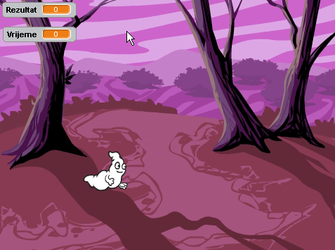
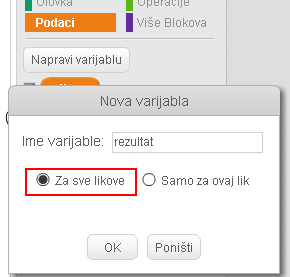
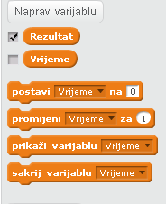
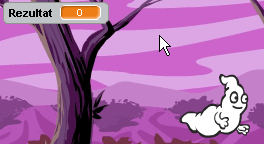
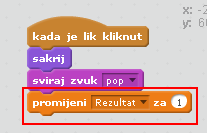
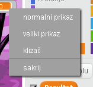

---
title: Istjerivači duhova
level: Scratch 1
language: hr-HR
stylesheet: scratch
embeds: "*.png"
materials: ["Club Leader Resources/*"]
...

## Uputa: { .challenge .pdf-hidden }
"Balon" projekt je premješten u  [Additional Scratch Projects](http://projects.codeclub.org.uk/en-GB/03_scratch_bonus/index.html) odjel.

# Uvod { .intro }

U ovom projektu napravit ćeš svoju prvu igru! To će biti igra hvatanja duhova. 

<div class="scratch-preview">
  <iframe allowtransparency="true" width="485" height="402" src="http://scratch.mit.edu/projects/embed/60787262/?autostart=false" frameborder="0"></iframe>
  
</div>

# Korak: Animacija duha. { .activity }

## Zadatci { .check }

+ Započni novi Scratch projekt i obriši lik mačke tako da projekt ostane prazan. Online Scratch nalazi se na linku <a href="http://jumpto.cc/scratch-new">jumpto.cc/scratch-new</a>.

+ Dodaj novog lika duha i prikladnu pozadinu.

	

+ Zatim dodaj sljedeće naredbe liku duha tako da se on neprestano pojavljuje i nestaje.

	```blocks
		kada je ⚑ kliknut
		ponavljaj
    	sakrij
    	čekaj (1) sekundi
    	prikaži
    	čekaj (1) sekundi
 		end
 	```

+ Testiraj program klikom na zelenu zastavicu.

## Spremi projekt { .save }

# Korak 2: Duh se pojavljuje na različitim mjestima { .activity }

Ovog duha je jako lako uhvatiti jer je nepomičan.

## Zadatci { .check }

+ Umjesto stajanja na istom mjestu, dopustit ćemo da Scratch sam odabere naumične koordinate x i y na kojima će se pojavljivati lik duha. Duhu dodaj 'idi na' { .blockmotion } naredbu, tako da blok naredbi izgleda ovako:

	```blocks
 		kada je ⚑ kliknut
 		ponavljaj
    			sakrij
    			čekaj (1) sekundi
    			idi na x:(slučajni broj od (-150) do (150)) y:(slučajni broj od (-150) do (150))
    			prikaži
    			čekaj (1) sekundi
 		end
	```

+ Provjeri rezultat klikom na zastavicu. Sada se svaki puta pojavljuje na drugačijem mjestu.

## Spremi promjene u projektu { .save }

## Izazov: Više nasumičnosti {.challenge}
Možeš li napraviti promjene u naredbi `čekaj` {.blockcontrol} tako da duh čeka neko vrijeme prije nego što se pojavi? Možeš li koristiti naredbu  `postavi veličinu` {.blocklooks} tako da duh bude različite veličine svaki puta kada se pojavi?

## Spremi promjene u projektu. { .save }

# Korak 3: Hvatanje duha { .activity }

Dopustimo igraču da hvata duhove!

## Lista aktivnosti { .check }

+ Kako bi dopustili igraču da uhvati duha, dodaj sljedeći kod:

	```blocks
 		kada je lik kliknut
 		sakrij
	```

+ Provjeri rezultat. Možeš li uhvatiti duha kada se pojavi? Ako ti je teško hvatati duhove možeš igrati igru na cijelom zaslonu klikom na ovaj gumb:

	

## Izazov: Dodavanje zvuka { .challenge }
Možeš li dodati zvuk svaki puta kada je duh uhvaćen?

## Spremi promjene u projektu. { .save }

# Korak 4: Dodavanje rezultata { .activity .new-page }

Napravimo igru zanimljivijom tako što ćemo dodati rezultat.

## Zadatci { .check }

+ Kako bismo pratili igračev rezultat potrebno nam je mjesto u koje će se on spremati. Takvo mjesto u programiranju nazivamo Varijabla.  __Varijabla__ je mjesto u koje program pohranjuje podatke koji će se tijekom izvršavanja programa mijenjati, kao što je rezultat.

	Kako bi stvorili novu varijablu, potrebno je na kartici 'Skripte', odabrati skupinu `Podaci` {.blockdata} i zatim kliknuti na  'Napravi varijablu'.

	

	Upiši 'Rezultat' kao ime varijable, odaberi da je varijabla dostupna svim likovima i klikni 'OK' kako bi se varijabla kreirala.
	
	Uoči kako se pojavilo nekoliko novih naredbi u skupini Podaci.'Rezultat' {.blockdata}.

	

	Također se rezultat pojavio i u gornjem lijevom kutu pozornice.

	

+ Sada je potrebno postaviti rezultat na nulu svaki puta kada program krene od početka:

	```blocks
		kada je ⚑ kliknut
		postavi [rezultat v] na [0]
	```

+ Svaki puta kada je duh uhvaćen, potrebno je povećati rezultat za jedan bod:

	

+ PPokreni program i hvataj duhove. Mijenja li se rezultat?

## Spremi promjene u projektu. { .save }

# Korak 5: Dodavanje mjerača vremena. { .activity }

Igra može biti još zanimljivija ograničavanjem vremena u kojem igrač može hvatati duhove.

## Zadatci { .check }

+ Za mjerenje vremena koristit ćemo novu varijablu. Napravi novu varijablu 'Vrijeme':

	

+ Želimo napraviti sljedeće:

	+ Početno vrijeme neka bude na 10 sekundi;
	+ Preostalo vrijeme smanjuje se svake sekunde;
	+ Igra prestaje kada vrijeme dođe do nule..

	Da bi to postigli, na   __pozornicu__ je potrebno dodati sljedeće naredbe:

	```blocks
		kada je ⚑ kliknut
		postavi [vrijeme v] na [10]
 		ponavljaj dok nije <(vrijeme) = [0]>
    	čekaj (1) sekundi
    	promijeni [vrijeme v] za (-1)
 		zaustavi [sve v]
  	```
	Ovako ćeš dodati  `ponavljaj do`{.blockcontrol}`vremena`{.blockdata}`= 0`{.blockoperators} kôd:

	

+ Povuci varijablu 'Vrijeme' na desnu stranu pozornice. Desnim klikom miša na varijablu možeš odabrati 'veliki prikaz' i promijeniti izgled varijable.

	

+ Zamoli prijatelje da isprobaju tvoju igru. Koliko bodova mogu osvojiti? Ako ti se igra čini prejednostavna možeš:

	+ Dati igraču manje vremena;
	+ Napraviti da se duhovi ne pojavljuju tako često;
	+ Smanjite duhove.

	Isprobaj igru nekoliko puta i doradi je sve dok ne bude dovoljno teška. 

## Spremi promjene u projektu.{ .save }

## Izazov: više objekata {.challenge}
Možeš li dodati više objekata u igru?


Moraš razmisliti koje objekte dodaješ. Razmisli o sljedećem:

+ Koliko je objekt velik?
+ Hoće li se pojavljivati češće nego duhovi?
+ Kako će izgledati/zvučati kada je uhvaćen?
+ Koliko ćete bodova dobiti ili izgubiti kada bude uhvaćen?

Trebaš li pomoć oko dodavanja drugih objekata, ponovi korake iznad.


## Spremi projekt. { .save }
