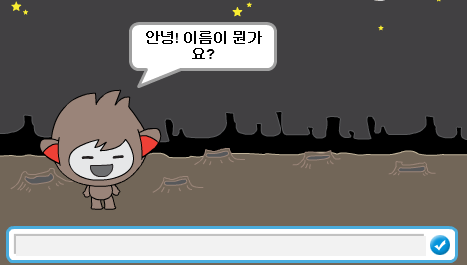
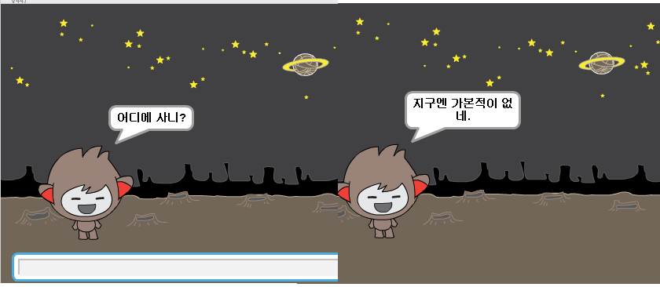

---
제목: 채팅 로봇
난이도: Scratch 1
언어: ko-KR
stylesheet: scratch
embeds: "*.png"
materials: ["Club Leader Resources/*"]
...

# 소개 { .intro }

자신만의 말하는 로봇을 프로그램 해볼 것입니다!

<div class="scratch-preview">
  <iframe allowtransparency="true" width="485" height="402" src="http://scratch.mit.edu/projects/embed/26762091/?autostart=false" frameborder="0"></iframe>
  
</div>

# 1 단계: 당신의 채팅 로봇 { .activity }

## 단계별 체크리스트 { .check }

+ 채팅 로봇을 만들기 전에 성격을 정해주세요.
	+ 이름은?
	+ 어디에 사는 가요?
	+ 행복한가요, 진지한가요, 웃긴 가요, 부끄러움을 타나요, 친근한가요?

+ 새 스크래치 프로젝트를 시작하고 고양이 스프라이트를 지워서 프로젝트가 텅 비게 만드세요. 온라인에서 사용할 수 있는 스크래치 에디터는 <a href="http://jumpto.cc/scratch-new">jumpto.cc/scratch-new</a>에서 볼 수 있습니다.

+ 이 중 하나의 캐릭터 스프라이트를 골라 프로젝트에 넣으세요:

	

+ 채팅 로봇의 성격에 맞는 배경을 정해주세요. 이건 예시이고 당신의 채팅 로봇도 이렇게 만들 필요는 없습니다:

	

## 프로젝트를 저장하세요 { .save }

# 2 단계: 말하는 채팅 로봇 { .activity }

채팅 로봇의 성격을 정했으니 당신에게 말을 걸도록 프로그램 해봅시다.

## 단계별 체크리스트 { .check }

+ 채팅 로봇 캐릭터를 클릭하고 이 코드를 넣으세요:

```blocks

이 스프라이트를 클릭했을 때
[안녕! 이름이 뭔가요?] 묻고 기다리기
[정말 좋은 이름이네요!] 을(를) (2) 초동안 말하기
```

+ 채팅 로봇을 클릭해서 시험해보세요. 이름을 물어보면 스테이지 아래의 박스에 입력해주세요.

	

+ 지금 채팅 로봇은 매번 `정말 좋은 이름이네요!`라고 대답할 뿐입니다. 사용자의 답에 따라 채팅 로봇의 반응에 개성을 줄 수 있습니다. 채팅 로봇의 코드를 이렇게 바꿔주세요:

```blocks

이 스프라이트를 클릭했을 때
[안녕! 이름이 뭔가요?] 묻고 기다리기
<[안녕] 와 (대답) 결합하기> 을(를) (2) 초동안 말하기
```

	마지막 블록을 만드려면 초록색 `...와... 결합하기` {.blockoperators} 블록을 `... 말하기` {.blocklooks} 블록에 드래그 해 넣어야 합니다.

	

	그리고 텍스트를 `hello` 에서 `안녕!`으로 바꾸고 하늘색 `대답` {.blocksensing} 블록을 (`관찰` 섹션에 있습니다) `world` 텍스트 위에 드래그 해넣으면 됩니다.

	

+ 새로 개량한 프로그램을 시험해보세요. 생각한 대로 작동하나요? 문제가 보인다면 해결할 수 있나요? (힌트: 어딘 가에 스페이스를 치면 됩니다!)

+ 사용자의 이름을 변수에 저장해서 나중에 다른 방식으로 사용하게 만드는 것도 좋을지도 모릅니다. 새 변수 `name` {.blockdata}을 만드세요. 변수를 만드는 방법을 잊어버리셨다면 `풍선`프로젝트를 다시 보세요.

+ 입력한 정보는 이미 특수 변수 `대답` {.blocksensing}에 저장되어 있습니다. 관찰 블록 그룹에 가서 대답 블록을 클릭해서 점이 보이게 하세요. 현재 `대답` {.blocksensing}에 있는 값이 스테이지 왼쪽 상단에 보이게 될 것입니다.

+ 새 변수를 만들었다면 채팅 로봇의 코드가 이렇게 보이게 만드세요:

```blocks

이 스프라이트를 클릭했을 때
[안녕! 이름이 뭔가요?] 묻고 기다리기
[name v] 에 (대답) 저장하기
<[안녕!] 와 (name) 결합하기> 을(를) (2) 초동안 말하기
```

+ 프로그램을 다시 시험해보면 답이 `name` {.blockdata} 변수에 저장되 있고 스테이지 왼쪽 상단에 보이는 걸 알 수 있습니다. `name` {.blockdata} 변수는 이제 `대답` {.blocksensing} 변수와 같은 값을 보입니다.

	

	스테이지 위에 변수가 보고 싶지 않다면 '스크립트'탭의 데이터 란에서 변수에 체크를 없애면 안 보여집니다.

## 프로젝트를 저장하세요 { .save }

## 도전과제: 더 많은 질문들 { .challenge }

채팅 로봇이 다른 질문도 할 수 있도록 프로그램 해보세요. 대답을 변수에 저장할 수 있겠 나요?



## 프로젝트를 저장하세요{ .save }

# 3 단계: 결정 하기 { .activity }

챗 봇이 사용자의 대답에 따라 무엇을 할지 결정을 내리도록 프로그램 할 수 있습니다.

## 단계별 체크리스트 { .check }

+ 채팅 로봇이 `예` `아니오` 대답을 할 수 있는 질문에 답할 수 있도록 만들어 봅시다. 이런 예가 있지만 질문은 바꿔 넣을 수 있습니다:

```blocks

이 스프라이트를 클릭했을 때
[안녕! 이름이 뭔가요?] 묻고 기다리기
[name v] 에 (대답) 저장하기
<[안녕!] 와 (name) 결합하기> 을(를) (2) 초동안 말하기
<[지금 기분 괜찮니?] 와 (name) 결합하기> 묻고 기다리기
만약 ((대답) = [응]) 라면
   [그거 참 다행이네!] 을(를) (2) 초동안 말하기
end
```

	사용자의 이름을 변수로 저장해 둬서 언제든지 사용할 수 있다는 점을 알아 두세요.

+ 프로그램을 제대로 시험해보려면 최소한 두 번은 시험해봐야 합니다 - 한번은 `아니`라고 답하고 한번은 `응`이라고 답해야 합니다 지금은 채팅 로봇의 `만약...라면` {.blockcontrol}에서 `응`이라고 대답했을 때만 답이 나와야 합니다.

+ 지금 문제는 `아니`라고 대답했을 때 대답이 없다는 것입니다. 이 문제를 고치려면 `만약...라면` {.blockcontrol} 블록을 `만약..라면..아니면` {.blockcontrol} 블록으로 바꾸면 됩니다:

```blocks

이 스프라이트를 클릭했을 때
[안녕! 이름이 뭔가요?] 묻고 기다리기
[name v] 에 (대답) 저장하기
<[안녕!] 와 (name) 결합하기> 을(를) (2) 초동안 말하기
<[지금 기분 괜찮니?] 와 (name) 결합하기> 묻고 기다리기
만약 ((대답) = [응]) 라면
   [그거 참 다행이네!] 을(를) (2) 초동안 말하기
아니면
   [이런! 안됐네.] 을(를) (2) 초동안 말하기
end
```

+ 이제 채팅 로봇을 다시 시험해보면 `응` 이나 `아니`로 대답할 때 둘다 반응이 있을 것입니다. 채팅 로봇은 `응`라고 대답했을 땐 ` 그거 참 다행이네!이라고 대답하고, `응`외의 무엇을 입력하던 `이런! 안됐네.` 라고 대답할 것입니다  (`아니면` {.blockcontrol} 은 '그 외'란 뜻입니다).

	

+ `만약` {.blockcontrol} 블록과 `아니면` {.blockcontrol} 블록 안엔 어떤 코드 던 집어 넣을 수 있습니다. 하지만 채팅 로봇이 말하게만 할 수 있는 건 아닙니다. 예를 들면 대답에 따라 채팅 로봇의 모양도 바뀌게 할 수 있습니다.

	채팅 로봇의 모양 탭으로 가보면 몇가지가 있을 수 있습니다. (없다면 직접 더해 넣을 수 있습니다!)

	

	이 코드를 더해 모양들을 채팅 로봇이 대답할 때 바뀌도록 할 수 있습니다:

	

+ 프로그램을 다시 시험해보면 채팅 로봇의 얼굴이 대답에 따라 달라지는 걸 볼 수 있습니다.

	

## 프로젝트를 저장하세요 { .save }

## 도전과제: 더 다양한 결정 { .challenge }

채팅 로봇이 `yes`나 `no`로 대답할 수 있는 다른 질문을 물어보게 하세요. 대답에 따라 반응하게 할 수 있나요?


## 프로젝트를 저장하세요 { .save }

# 4 단계: 장소 바꾸기 { .activity }

채팅 로봇이 있는 배경을 바꾸게 프로그램 할 수 있습니다.

## 단계별 체크리스트 { .check }

+ 스테이지에 다른 배경을 더해보세요, 예를 들자면 'moon' 배경을 더할 수 있습니다.

	

+ 이제 채팅 로봇이 장소를 바꾸도록 프로그램을 바꿀 수 있습니다. 이 코드를 넣으세요:

```blocks
[난 지금 달로 갈 건데 같이 갈래?] 묻고 기다리기
만약 ((대답) = [응]) 라면
   배경을 [moon v] (으)로 바꾸기
end
```

+ 또한 채팅 로봇에게 말을 걸 땐 먼저 원래 배경에 있도록 만들어야 합니다. 이 코드를 채팅 로봇의 코드에 더해주세요:

	

+ 프로그램을 시험해서 달로 가고 싶냐 고 물을 때 `응`이라고 대답하세요. 채팅 로봇이 있는 장소가 바뀐 걸 볼 수 있습니다.

	

+ 채팅 로봇이 `아니`라고 대답했을 때도 다른 장소로 가는 가요? `잘 모르겠 어`라고 대답했을 땐 어떤 가요?

+ 이 코드를 `만약`{.blockcontrol} 블록 안에 넣어서 채팅 로봇이 답이 `응`라면 위아래로 네 번 뛰게 만들 수 있습니다:

```scratch
(4) 번 반복하기
   y좌표를 (10) 만큼 바꾸기
   (0.1) 초 기다리기
   y좌표를 (-10) 만큼 바꾸기
   (0.1) 초 기다리기
end
```

	

+ 코드를 다시 시험해보세요. 답이 `응`이면 채팅 로봇이 뛰나요?

## 프로젝트를 저장하세요 { .save }

## 도전과제: 자신만의 채팅 로봇 만들기 {.challenge}

지금까지 배워온 것들을 응용해서 채팅 로봇을 완성시키세요. 이건 사용할 만한 몇가지 아이디어 들입니다:


채팅 로봇을 완성했으면 친구들이 채팅 로봇과 대화를 시도해보도록 하세요! 친구들이 채팅 로봇을 좋아하나요? 문제를 발견했나요? 

## 프로젝트를 저장하세요 { .save }
